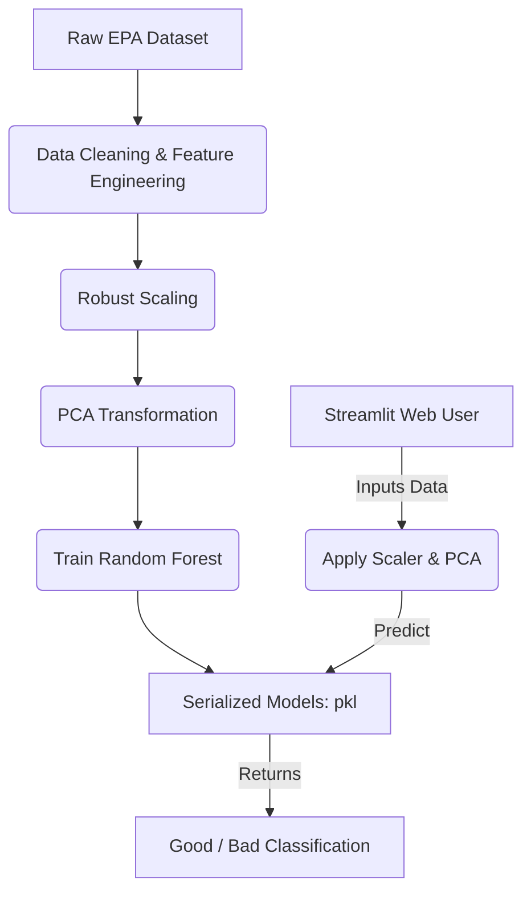

# Air Quality Classification Model

### Predicting Environmental Quality from Spatial and Observation Data

**University:** EELU (Egyptian E-Learning University)

**Under the Supervision of:**

- **Dr.** Wafaa Sami
- **Eng.** Shahd

**Team Members:**

1. Abdelazez Merzek Eid (ID: 2301980)
2. Basma Yasser Anter Mohamed (ID: 2302152)
3. Steven haroon bakheet (ID: 2302242)
4. Malak Mohamed Ahmed Bashir (ID: 2302628)
5. Ibraheem Mohammed Abd El-Twab (ID: 2301915)

---

## 1. Project Overview & Objectives

**The Problem:**
Air pollution has severe implications for public health and climate change. Monitoring and accurately classifying air quality based on numerical features is crucial for early interventions.

**Main Objective:**
To build a robust Machine Learning pipeline that classifies air quality into binary outcomes ("Good" ✅ or "Bad" ❌) based on complex environmental, numerical, and spatial statistics.

**Technologies Used:**

- Python, Pandas, Scikit-Learn (Data & ML)
- PCA, RobustScaler, SMOTE (Data Preprocessing)
- Streamlit (Web UI)

---

## 2. Dataset Information

- **Dataset Name:** EPA Air Quality Annual Summary (`epa_air_quality_annual_summary.csv`)
- **Data Size & Scale:** Approximately 500 MB in size, consisting of over 2 Million rows and records collected from various monitoring stations.

**Key Features Extracted:**

1. **Spatial Variables:** Latitude, Longitude (identifying the monitoring stations).
2. **Temporal Variables:** Year, Sample Duration, Valid Day Count, Required Day Count.
3. **Statistical Variables:** Observation Count, Completeness Indicator, Exception Data Count.
4. **Pollutants Types:** Ozone, PM2.5 (Local Conditions), PM10 Total, Sulfur Dioxide, Carbon Monoxide, Nitrogen Dioxide.

---

## 3. Data Preprocessing & Cleaning

Complex environmental data requires significant transformation to train effective models:

- **Handling Missing Values & Features Drop:** Unnecessary descriptive columns (like address, state codes) were removed to avoid overfitting.
- **Robust Scaling (`scaler.pkl`):** Used to normalize numerical data ranges. It is specifically strong against extreme outliers (e.g., occasional pollution spikes).
- **Addressing Class Imbalance:** Handled techniques on the dataset (e.g., using SMOTE) to ensure the model doesn't bias toward the majority class.
- **Dimensionality Reduction (`pca.pkl`):** Principal Component Analysis (PCA) was used to compress features while retaining the maximum variance, thereby speeding up training.

---

## 4. Machine Learning Model

**Algorithm Chosen:** Random Forest Classifier (`random_forest_model.pkl`)

**Why Random Forest?**

- **Non-Linearity:** Excels in capturing complex relationships between geographical locations and specific pollution readings.
- **Robustness:** Handles high-dimensional data (post-PCA) effectively without deep tuning.
- **Ensemble Power:** By combining multiple decision trees, it strongly reduces the risk of overfitting and increases prediction accuracy on unseen data.

---

## 5. System Architecture & Workflow

---

## 6. Real-Time Application (Streamlit)

To make the AI accessible, we developed an interactive web interface:

- **Framework:** `App.py` built with **Streamlit**.
- **Interactive Inputs:** Evaluators can manually input details like `Observation Count`, `Pollutant Type` (e.g., PM2.5), and `Sample Duration`.
- **Live Inference:** The application instantly processes these inputs through the `scaler` and `pca` objects and leverages the `random_forest_model` to return a clear **Good ✅** or **Bad ❌** verdict.

---

## 7. Conclusion & Future Work

**Conclusion:**
We successfully demonstrated an end-to-end Machine Learning ecosystem capable of digesting complex, multi-dimensional environmental data and outputting straightforward, actionable air quality assessments.

**Future Enhancements:**

1. **Live Data Integration:** Connect to real-time EPA APIs instead of static variables.
2. **Multi-class Classification:** Predict exact Air Quality Index (AQI) brackets instead of pure binary (Good/Bad).
3. **Geospatial Mapping:** Integrate dynamic Folium maps in Streamlit to visualize predictions geographically.

---

# Thank You!

### Any Questions?
